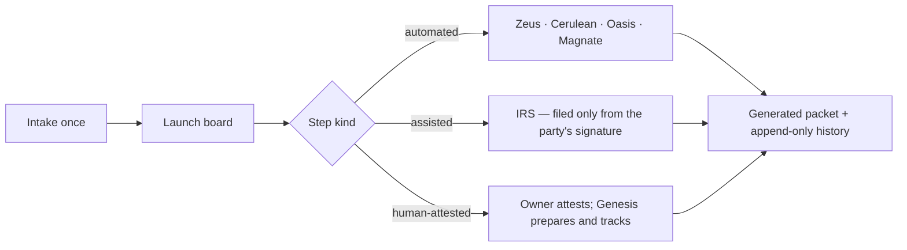

# Genesis — BusinessOps roadmap

> The **BusinessOps** platform of the
> [Innotel Platform Stack](https://github.com/innotelinc/innotel-platform-stack)
> — an [Innotel Labs](https://github.com/innotelinc) product. See
> [docs/stack.md](docs/stack.md) for the owns/consumes boundary and
> [docs/Architecture.md](docs/Architecture.md) for the engine, the provider
> contract and the data model.
>
> Status legend: `[x]` shipped · `[~]` in progress · `[ ]` planned · `[-]` out of
> scope for v1
>
> This is the single source of truth for **what** Genesis does and **what comes
> next**. It is written so the next person reads the code rather than rebuilding
> it: every shipped line points at the file that carries it, and every open line
> says what is missing rather than implying it is done.

> **Status.** **0.1 shipped** — one record, thirteen steps, six generated
> packets, and the automation boundary enforced in code rather than in prose.
> **What is not shipped is a launch, end to end, against the live line**: the
> provider contracts are written from the sibling platforms' APIs and marked
> where they still need confirming, and the EIN fax path is complete in code but
> has not carried a real SS-4 to the IRS. **0.2 is the milestone that closes
> that**, because it is the only one that cannot be reasoned into existence.
> **v1.0 is "an operator can run this for other people"** — the launch path
> proven, and the deployment posture written down.

---

## 1. Vision

Take a business's facts **once**, then drive every downstream step — the entity
filing, the EIN, the telephone number, the domain, the mailbox, the bank packet,
the D-U-N-S number, the bureau files — on the platforms the stack already owns.
Automate what the stack owns, and **prepare, but never impersonate**, everything
that needs the owner's signature.

## 2. v0.1 status (shipped)

| Capability | Status |
| --- | --- |
| Intake — entity, formation state, operating address, responsible party, domain, number region | `[x]` |
| Workflow engine — 13 steps, 4 phases, real dependencies, progress that ignores optional steps | `[x]` |
| Automated providers — Zeus (number), Cerulean (domain + TLS), Oasis (mailbox), Magnate (subscription) | `[x]` |
| The assisted EIN filing — prefilled SS-4, recorded designee authorization, fax through Zeus | `[x]` (code complete) |
| Human-attested providers — formation state, Google, bank, D&B, Experian, Equifax, directories | `[x]` |
| Generated PDF packets — SS-4, bank, Google, D-U-N-S, bureaus, listings | `[x]` |
| Reviewed SS-4 field mapping, proven by re-reading the official form | `[x]` |
| Credit readiness — six factors, 100 points, personal lines excluded | `[x]` |
| Automation policy — declared once, asserted in tests, re-checked in CI | `[x]` |
| Read-only integration preflight (`scripts/check-integrations.mjs`) | `[x]` |
| Cerulean Authentik SSO — no passwords stored, subject linked to a client | `[x]` |
| Client tenancy — a client sees its own businesses; another's answers 404 | `[x]` |
| Signara hand-off — a rendered packet goes out for signature, Genesis never signs | `[x]` |
| Store — SQLite, append-only event history, versioned migrations | `[x]` |
| Unit suite (`node --test`), typecheck, ESLint, production build | `[x]` |

**v0.1 is complete as a workflow product.** What is outstanding is not the
workflow — it is that no launch has been carried end to end against the live
line, and the deployment posture is not yet written down.

## 3. Architecture recap

- **The workflow core is pure.** `src/lib/workflow/` (catalog, engine, policy)
  has no framework or database imports, which is what lets the whole domain run
  under `node --test` with no test framework.
- **The automation boundary is code, not documentation.**
  `assertAutomationAllowed` refuses a step whose declaration and policy
  disagree, `src/lib/providers/irs.ts` calls it *at the moment it transmits*, and
  CI re-checks the catalog/policy invariant against the compiled output. Three
  things are never automated — signing, opening a bank account or bureau
  registration, and creating a Google Business Profile — and the address gate
  (`readiness()` + `validatePrincipalAddress()`) refuses every hand-off until the
  principal place of business is a real street address.
- **One store, one directory.** `src/lib/paths.ts` is the single answer to "where
  does this deployment keep its data": the SQLite database and the signed
  documents are two children of one `GENESIS_DATA_DIR`, so one backup takes the
  record and the evidence together.
- **The provider layer never touches the filesystem.** A step route loads the
  bytes and hands them to the provider, which is what keeps the providers pure
  and testable.
- **Stack placement.** Genesis is the **BusinessOps** member of the family: it
  consumes identity (Authentik), secrets (Cerulean Vault), trust (Cerulean),
  telephony (Zeus), mail (Oasis), revenue (Magnate) and the edge (NPM), and owns
  only the business-launch workflow itself.

## 4. Milestones

### v0.1 — The workflow `[x]`
The feature set in §2. Exit met: a business's facts are captured once, its steps
are planned and tracked with real dependencies, and every artifact it needs is
generated from that one record — with the automation boundary refusing the
things a third party must not do.

### v0.2 — One launch, end to end `[ ]`
**Goal:** replace "written from the sibling platform's API" with "carried out on
the live one". This is the milestone that cannot be reasoned into existence, and
it is the one that matters most: everything above is a claim about a pipeline
nobody has run to the end.

- `[ ]` **Confirm every provider contract against the live deployment.** Each
  contract in [docs/Integrations.md](docs/Integrations.md) is marked with what
  still needs confirming. The list is finite and the work is reading a real
  response rather than arguing about a plausible one.
- `[ ]` **Carry one signed Form SS-4 to the IRS by fax, and record what came
  back.** The path is complete in code and gated on the designee authorization
  plus the signed copy; what it has never done is transmit. This needs the IRS
  fax line configured (`IRS_EIN_FAX_NUMBER` / `IRS_EIN_FAX_BY_STATE`) and Zeus's
  fax route on a confirmed service-token path. The acceptance is a recorded
  transmission, and the honest outcome for a rejected filing recorded as an
  outcome rather than as a failure.
- `[ ]` **A launch packet: the business's own record, exported.** The append-only
  event history and the generated documents exist; what a client or an auditor
  cannot do is take them away. One document — the facts, every step and its
  attestation, the generated packets, and the filing evidence — produced by the
  same renderers the step routes use, so the packet cannot disagree with the
  board. This is the family's evidence pattern (OnTrak's certificates, Tix's
  assurance packets) applied to the one place a business actually needs it.
- `[ ]` **Refuse a filing the state will not accept, before the owner signs it.**
  The readiness gate already refuses a business with no principal address; the
  same class of pre-check applies to the SS-4's own required lines, so an owner
  is told what is missing rather than finding out from a rejected fax.
- **Exit:** a business goes from intake to a filed EIN on the live stack with no
  hand-editing, and the packet it produced can be handed to a third party.

### v0.3 — Tenancy at the edge `[~]`
**Goal:** more than one client, and each of them able to see the truth about
their own launch without asking the operator.

- `[x]` **Identity and isolation.** Authentik SSO, one client record per
  subject, and `authorizeBusiness` answering 404 — not 403 — for a business that
  belongs to somebody else, so the API never confirms another client's record
  exists.
- `[x]` **One data directory.** `GENESIS_DATA_DIR` now governs the database as
  well as the documents (`src/lib/paths.ts`); before, the database always went to
  `process.cwd()/data`, which coincided with the volume on the shipped compose
  and would have split silently anywhere else.
- `[x]` **A test for the tenancy rule, not just the comment.** "A client may only
  touch its own businesses" was asserted in a comment inside `src/lib/authorize.ts`
  — a module that imports `next/headers` — so the one property the portal is sold
  on was the one nothing exercised. The decision now lives in
  `src/lib/tenancy-rules.ts`, pure and tested, and `authorize.ts` and
  `session.ts` both call it, so "who may reach what" and "who is an operator"
  have one answer each rather than a copy per call site. Two properties are pinned
  rather than described: **a refusal never says whether the business exists**
  (another client's business and a business that was never created produce the
  same status and the same sentence, because a 403 confirms a record and a 404
  does not), and **a blank admin-group list denies rather than defaulting** — the
  difference between a setting that is absent and one deliberately set to nothing,
  which is the usual way an access-control bug ships. Covered by
  `tests/tenancy.test.ts`.
- `[ ]` **Per-client notification on a step that needs the owner.** The board
  shows it; nobody is told. A launch stalls in "waiting on the owner" exactly
  when a person has stopped looking.
- `[ ]` **An operator surface: every client, every business, what is blocked and
  on what.** Administrators can already see everything through the API; the
  question an operator has is across clients, not within one.
- **Exit:** two clients run launches at once without seeing each other, and a
  step waiting on an owner tells the owner.

### v1.0 — A launch service an operator can run `[ ]`

**Goal:** the 1.0 claim is narrow and testable — **somebody other than the
person who built it can run this for other people.**

- `[~]` **Deployment posture, written down.** The fail-fast session secret and
  Vault references are in place; what is owed is one page: what Genesis holds,
  what it must never hold (identity, secrets, DNS, mail, billing, storage), and
  what it means that it holds the signed Form SS-4 that a filing was made from.
  A threat model, in the family's shape.
- `[ ]` **A restore that has been rehearsed.** The SQLite database is the
  business's record and the `filings/` directory beside it is the evidence the
  filings were made from; a backup nobody has restored is a belief. Take a
  backup, boot it somewhere else, and ask it the questions that matter: does it
  know the businesses, does it carry the history, is the signed copy still
  readable.
- `[ ]` **An operator runbook.** Deploy, sign in, read the preflight
  (`make check-integrations`), tell the three kinds of step apart when something
  stops, re-drive a filing whose fax was rejected, take a client out without
  destroying their record, and the incident order when a filing is in doubt —
  where the answer is "the signed copy on the volume is the evidence, and it is
  not to be edited".
- `[ ]` **Version and upgrade posture.** Which sibling APIs this is verified
  against, what breaks when one of them moves, and how the image rolls forward
  and back. `docs/Integrations.md` is the contract; this is the runbook around it.
- `[ ]` **A health surface that says what is actually wrong.** `/api/health`
  answers; the integrations preflight is a script. The operator surface should
  carry the preflight's verdict, so "Zeus is not answering" is visible before an
  owner is told their number is on its way.
- **Exit:** an operator deploys it, launches a business for a client they did not
  onboard by hand, restores the record from a backup they rehearsed, and can
  answer "what did we file, and where is the copy that was signed" without a
  shell.

### v2.0 — Beyond one launch `[ ]`
- **Catalog of entity types and states.** The workflow is one shape today;
  formation requirements are not one shape (an LLC in one state is not an LLC in
  another), and the catalog is the place that difference belongs.
- **Renewals and filings after launch** — annual reports, registered-agent
  renewals, licence renewals — as steps that arrive on a schedule rather than
  because somebody remembered.
- **Bulk intake** for an operator onboarding several businesses at once.
- **A partner/expert surface** for the steps that are human-attested, so a
  preparer can be handed the exact packet and destination Genesis already
  computed.
- **Exit:** the product tracks a business's filings for more than its first
  year, and a second state's entity type is a catalog entry rather than a code
  change.

## 5. Cross-cutting requirements

- **The boundary is enforced, not documented.** A rule about what Genesis may do
  belongs in `src/lib/workflow/policy.ts` and a test; a rule that lives only in a
  README is a rule that will be broken by the next person in a hurry.
- **Never sign, never impersonate.** Genesis files only what the responsible
  party signed, and it stops and says which thing was missing.
- **Empty is better than wrong.** A government field that cannot be verified
  stays blank, and the alias table that fills the others is proven by re-reading
  the fetched form — a wrong value in a filing is worse than an empty one.
- **One record, one directory.** Everything a launch produced is derived from the
  record, and everything it left behind is under one configured directory.
- **Testing** — every behaviour change ships a test; the pure core stays pure so
  it stays unit-testable, and the one deliberate exception (`db.ts`) is stated in
  `tsconfig.test.json` rather than left implicit.

## 6. Success metrics

| Metric | Why |
| --- | --- |
| Launches completed end to end | The only claim that matters at 1.0 |
| Steps that stopped for a missing authorization or signed copy | Whether the boundary is real or nominal |
| EIN filings accepted ÷ filed, and the rejection reasons | Whether the SS-4 line mapping holds up outside the tests |
| Manual hand-edits per launch | Where the automation still is not automated |
| Time from intake to filed EIN | The product's whole promise |
| Launch packets exported | Whether the evidence is actually used by anyone |

## 7. Risks & open questions

- **The pipeline has never been run to the end.** Every provider contract is a
  careful reading of a sibling platform's API, not a verified integration. This
  is the largest risk in the product and v0.2 is the answer to it; until then,
  treat the contracts as design, not fact.
- **Filing on someone's behalf.** The design says the responsible party signs and
  authorizes; the risk is a workflow that makes "authorize" a checkbox the
  operator clicks on the owner's behalf. The signature and the authorization are
  separate recorded facts for that reason, and the fax path reads both.
- **State-specific formation requirements** are the reason v2.0 is a catalog
  problem rather than a features problem; doing it ad hoc would put compliance
  logic in prose.
- **Personal data.** Genesis holds a responsible party's name, address and — in
  a filing context — the fields a form asks for. Retention and access belong in
  the v1.0 posture, designed rather than inherited from "it is on the volume".
- **Sibling platform drift.** Each consumed platform can move independently; the
  preflight exists so drift is found by an operator rather than by a client.

## 8. Immediate next steps

1. Confirm the provider contracts in [docs/Integrations.md](docs/Integrations.md)
   against the live Zeus/Cerulean/Oasis/Magnate deployments, marking each one as
   verified with the date and the response it was verified against (v0.2).
2. Configure the IRS fax line and Zeus's fax service-token path, then carry one
   signed SS-4 through the fax route and record the outcome — including a
   rejection, if that is what happens (v0.2).
3. Extract the tenancy decision from `src/lib/authorize.ts` into a pure rule and
   pin it with a test, the way the automation policy already is (v0.3).
4. Write the v1.0 posture page — what Genesis holds, what it must never hold, and
   what it means that it holds the signed copy (v1.0).
5. Rehearse a restore of the database and `filings/` together, because they are
   one piece of evidence (v1.0).
